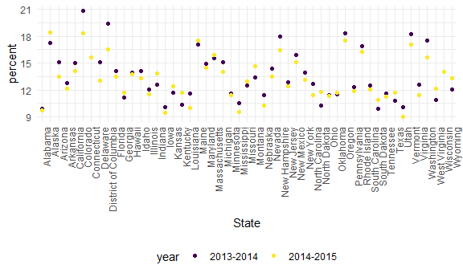
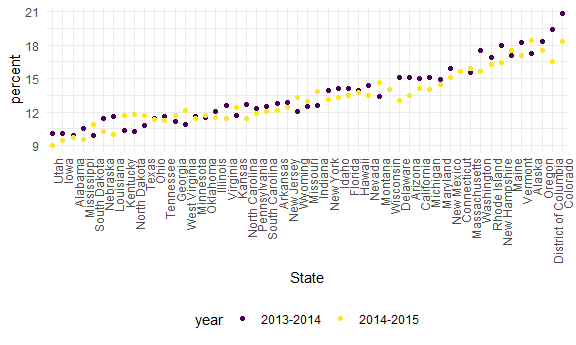

stringsandfactors
================

``` r
knitr::opts_chunk$set(
  fig.width = 6,
  fig.asp = .6,
  out.width = "90%"
)

theme_set(theme_minimal() + theme(legend.position = "bottom"))

options(
  ggplot2.continuous.colour = "viridis",
  ggplot2.continuous.fill = "viridis"
)

scale_colour_discrete = scale_colour_viridis_d
scale_fill_discrete = scale_fill_viridis_d
```

## Mostly use string vectors

helpful for filtering based on character in a certain column

``` r
string_vec = c("my", "name", "is", "Vaidehi")

str_detect(string_vec, "Vaidehi") # where do i find vaidehi exactly in the vector
```

    ## [1] FALSE FALSE FALSE  TRUE

``` r
str_detect(string_vec, "e") #where is e
```

    ## [1] FALSE  TRUE FALSE  TRUE

``` r
                            # str_detect is case sensitive

str_replace(string_vec, "Vaidehi", "VC")
```

    ## [1] "my"   "name" "is"   "VC"

``` r
str_replace(string_vec, "e", "E") # replace to capital E
```

    ## [1] "my"      "namE"    "is"      "VaidEhi"

``` r
str_replace(string_vec, "e", "") # replace the e with nothing, helpful to get rid of white space. 
```

    ## [1] "my"     "nam"    "is"     "Vaidhi"

``` r
str_remove(string_vec, "e") # only include waht you want to remove. in this case e
```

    ## [1] "my"     "nam"    "is"     "Vaidhi"

``` r
string_vec = c(
  "i think we all rule for participating",
  "i think i have been caught",
  "i think this will be quite fun actually",
  "it will be fun, i think"
  )

str_detect(string_vec, "^i think") # detecting the thing in quoations only at start of vector
```

    ## [1]  TRUE  TRUE  TRUE FALSE

``` r
str_detect(string_vec, "i think$") # detecting the thing in quoations only at end of vector
```

    ## [1] FALSE FALSE FALSE  TRUE

``` r
str_remove(string_vec, "i think$") # gets rid of i think at end of vector only
```

    ## [1] "i think we all rule for participating"  
    ## [2] "i think i have been caught"             
    ## [3] "i think this will be quite fun actually"
    ## [4] "it will be fun, "

pumpkin theme example

``` r
string_vec = c(
  "Time for a Pumpkin Spice Latte!",
  "went to the #pumpkinpatch last weekend",
  "Pumpkin Pie is obviously the best pie",
  "SMASHING PUMPKINS -- LIVE IN CONCERT!!"
  )

str_detect(string_vec,"[Pp]umpkin") # capitol or lower case p being identified
```

    ## [1]  TRUE  TRUE  TRUE FALSE

more complex number followed by letter

``` r
string_vec = c(
  '7th inning stretch',
  '1st half soon to begin. Texas won the toss.',
  'she is 5 feet 4 inches tall',
  '3AM - cant sleep :('
  )

str_detect(string_vec, "^[0-9][a-zA-Z]") # ids number followed by letter
```

    ## [1]  TRUE  TRUE FALSE  TRUE

``` r
string_vec = c(
  'Its 7:11 in the evening',
  'want to go to 7-11?',
  'my flight is AA711',
  'NetBios: scanning ip 203.167.114.66'
  )

str_detect(string_vec, "7.11") # 7 "some character" and then 1. anything is a special character
```

    ## [1]  TRUE  TRUE FALSE  TRUE

but if you want to specifically find a special character (such as \[ (
or . )\]) then you have to add a slash. but slash is also special
character so have to add another slash to find the period.

``` r
string_vec = c(
  'Its 7:11 in the evening',
  'want to go to 7-11?',
  'my flight is AA711',
  'NetBios: scanning ip 203.167.114.66'
  )

str_detect(string_vec, "7\\.11") # 2 backslashed to id .
```

    ## [1] FALSE FALSE FALSE  TRUE

## Factors

``` r
vec_sex = factor(c("male", "male", "female", "female")) # see that levels are identified for vector
as.numeric(vec_sex) # the factors in number form
```

    ## [1] 2 2 1 1

``` r
vec_sex = fct_inorder(vec_sex) # change levels from female male to male female. factor ordering is helpful for reference group
                                # default ordering is alphabetical
```

# revisit NSDUH

Import NSDUH data from web

``` r
url = "https://samhda.s3-us-gov-west-1.amazonaws.com/s3fs-public/field-uploads/2k15StateFiles/NSDUHsaeShortTermCHG2015.htm"

drug_use_html = read_html(url)
```

``` r
nsduh_df = 
  drug_use_html |> 
  html_table() |> 
  first() |> 
  slice(-1)
```

now tidying

we have age and year in same line, remove p value columns, need to do
some pivoting

``` r
marj_df = 
  nsduh_df |> 
  select(-contains("P Value")) |>  # find all p value phrase and remove those columns
  pivot_longer(
    -State, # don't include state column in teh range
    names_to = "age_year",
    values_to = "percent"
  ) |> 
  separate(age_year, into = c("age", "year"), sep = "\\(") |>  #split into two columns, what we are looking for when we seperate is ( but since ( is seperate character we add backslash
  mutate(
    year = str_remove(year, "\\)"),
    percent = str_remove(percent, "[a-c]$"), # getting rid of random characters.
    percent = as.numeric(percent) # make percent numeric
  ) |> 
  filter(
    !State %in% c("Total U.S.", "Northeast", "Midwest", "South", "West")
  ) # get rid of the above rows - rid bc !
```

make a plot

state is character variable, so r goes alphabetical for order

``` r
marj_df |> 
  filter( age == "12-17") |> 
  ggplot(aes(x = State, y = percent, color = year)) +
  geom_point() +
   theme(axis.text.x = element_text(angle = 90, hjust = 1))
```



could also do

``` r
marj_df |> 
  filter( age == "12-17") |> 
  mutate(State = fct_reorder(State, percent)) |> 
  ggplot(aes(x = State, y = percent, color = year)) +
  geom_point() +
   theme(axis.text.x = element_text(angle = 90, hjust = 1))
```


